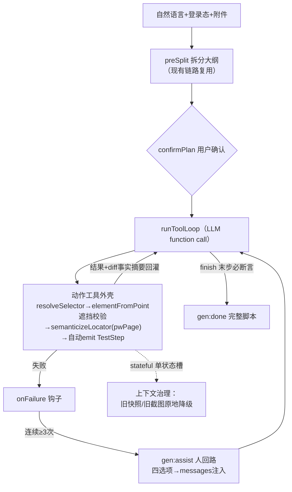

## 产品概述

将测试用例生成工具的主流程从「预拆分计划 → 用户确认 → 逐步 act/observe 执行」升级为 **LLM function call 驱动的智能体模式**（runToolLoop 全程在回路），并配套引入组件库插件机制、browser-use 式上下文管理与三层视觉增强，系统性提高生成步骤对 antd / element-ui 类站点选择器的操作成功率与执行准确率。generate() 主流程将直接升级为新链路（不设模式切换开关），旧实现的回退通过 git 版本历史在代码层面完成。

## 核心功能

- **生成工具回路**：模型自主选择工具（快照/点击/填写/断言/兜底act/结束等），动作成功即自动语义化定位并落库为 TestStep；拆分计划降级为大纲软约束注入提示词。
- **人在回路融入循环**：定位连续失败挂起求助（重新描述/AI修正/手动捕获/跳过四选一），人类决策以消息注入方式恢复循环；支持停止后续跑（对话消息持久化）。
- **上下文治理**：单状态槽覆盖式刷新旧快照与旧截图、回灌内容单行化、首尾保护与输入水位观测，长任务不滚雪球。
- **三层视觉**：①免费的稳定等待（多帧像素hash）+点击遮挡校验+动作前后diff生效确认；②变化区域反查元素序号表生成一行事实摘要随回灌；③视口标注截图常驻随快照发送+see(region) 区域高清裁剪诊断（384 token 固定计价场景下以裁剪换清晰度）。
- **组件插件体系**：插件注册表（检测/候选增强/专用工具/知识段四插槽），内置 antd 与 element-plus 插件，select_option 专用工具固化“触发器→弹层→选项”操作套路；所有插件候选一律过既有 count===1+同节点验证管线。
- 全程保持 WebSocket gen:* 事件契约与前端零变更，步骤仍为持久化语义定位器（确定性回放不受影响）。

## 技术栈

- 沿用现有栈：Node 后端 Fastify5(ESM/tsx)、Stagehand v4 + playwright-core（CDP 桥 `connectPwView` 提供 getBy*/evaluate/screenshot 能力）、OpenAI 兼容网关（deepseek-v4-flash，`openaiModelVision` 主模型多模态）、zod shared schema、Prisma7+SQLite、React18+antd5（前端零改动）。
- 不新增运行时依赖：像素比对用自研 hash（pHash 降采样即可）；截图/裁剪用 playwright 自带 API。

## 实现方案

### 总体思路

指挥棒从「计划数组 for-of 执行」换成「messages 数组 runToolLoop」，现有资产（语义化管线/人回路 setWait/手动捕获/占位符/暂停GC/大纲确认链）原样挂接；浏览器级操作统一经 CDP 桥 pwPage。



### 关键设计决策

1. **动作工具统一外壳**（genToolHost）：每个动作工具 = 参数解析（数字索引→xpathMap）→ 真实执行 → `document.elementFromPoint` 遮挡校验 → `semanticizeLocator`（mode='playwright'，同节点精确）→ `buildDirectStep` 自动 emit（instruction 必填，供回放自愈）→ 回灌含「已记录为第N步」+ diff 事实摘要。失败尝试天然不入库。
2. **runToolLoop 约 20 行增强**：`AgentTool.stateful?: 'snapshot'|'screenshot'` 标记 + push 新结果前将历史同槽 `tool_call_id`（Set 维护）content 原地改写为一行占位；`onFailure(name,args,error)` 钩子返回 null 照常回灌自愈；结果单行化上限 400 字符（snapshot 除外）；首条 user 永不触碰 + 最近 3 轮保原文 + inputTokens 水位触发中间压缩。
3. **人回路=消息注入**：AssistDecision 四出口分别映射为「{role:'user'} 重新描述」「AI修正直接执行+emit 后回灌完成」「CapturedEvent 经 buildCapturedStep emit 后回灌」「回灌已跳过请另寻路径」；续跑 = steps+messages 序列化入生成记录（字段探明后落 GenerationLog meta，必要时补一条 prisma 迁移），pauseJob abort 后由 continueGenerate 读回。
4. **视觉降级顺序**：`openaiModelVision===true` 才注册截图类能力；snapshot 工具同 result 组装 DOM 序号树 + 视口标注截图（fullPage 禁用、devicePixelRatio:1）；本地 hash 未变跳过发图；see(region) 只发变化 bounding box 高清裁剪。开工前先跑一次 1080p 表格页真网关读字基线，据此定标注线宽/字号参数（写入代码注释）。
5. **红线**：插件与工具产出的候选一律经 `verifyCandidates(count===1+isSameNode)` 验证后经 `buildLocatorFromCandidate` 落库；index/xpathMap 仅作生成期临时引用；禁止 dispatchEvent 假事件。

### 性能与可靠性

- 每次 LLM 轮次 = 一整条对话，token 成本高于现模式；三板斧对冲：MAX_SNAPSHOT_CHARS 现有截断、summarizeSteps 充当免费历史摘要源、usage.inputTokens 旁路水位。
- deepseek-v4-flash 连续多轮 parallel tool-calls 为已知最大不确定点：以真实冒烟清单验证并归档结论；如需回退旧实现，通过 git 版本历史在代码层面完成（配置层不保留模式开关）。
- 截图 hash 判定与稳定等待均为本地毫秒级开销，不阻塞主流程上限 3s 兜底。

## 目录结构

```
test-tool/
├─ server/src/services/
│  ├─ toolLoop.ts                    # [MODIFY] AgentTool.stateful 标记+历史改写；onFailure 钩子；结果单行化；首尾保护+水位压缩
│  ├─ generationToolHost.ts          # [NEW] GenToolContext（pwPage/xpathMap/sysVars/envMap/steps/截图hash）；buildGenTools：snapshot/goto/click/fill/press/check/select/act/assert/wait/readText/extract/see/finish；actionShell 统一封装（遮挡校验+语义化+自动emit+diff摘要）；wait 稳定等待
│  ├─ visualFrameService.ts          # [NEW] 视口截屏(png b64, dpr=1)+帧hash缓存（画面未变跳过重发）+region 裁剪+前后两帧 diff（无 match 库，降采样灰度逐像素）+bbox 反查序号
│  ├─ generationService.ts           # [MODIFY] generate() 升级为智能体模式（移除计划 for-of 执行分支）；大纲注入 system prompt；assist 四出口改造；continueGenerate 读回 messages；replanAfterRevoke 起新 loop；act 兜底逻辑平移
│  ├─ locatorCandidateScript.ts      # [MODIFY] 扩展 __ttCollectInteractive（仅可交互元素编号+*[n]*新元素标记）与 __ttDrawOverlays（粗边框≥3px+白底序号块，findModalScope 硬编码迁至组件插件回调）
│  └─ componentPlugins/              # [NEW] 插件注册表
│     ├─ registry.ts                 # register({id,detect,candidates,tools,knowledge})，惰性 DOM 特征探测，命中的 candidates 前插 computeCandidates、tools 并入工具清单、knowledge 拼 system prompt
│     ├─ antd.ts                     # Select(.ant-select-dropdown:not(-hidden))两段式 select_option；Form.Item label 收割 role/name 候选
│     └─ elementPlus.ts              # el-select 弹层 display 判定、el-form-item label
├─ server/prisma/schema.prisma       # [MAYBE] 仅当生成日志表缺 meta Json 字段时加字段+migrate
├─ server/tests/genToolHost.test.ts  # [NEW] 稳定等待/遮挡校验/diff伪造Page、actionShell emit、assistant四出口注入、pause-resume round-trip
├─ server/tests/contextRewrite.test.ts # [NEW] stateful 改写、单行化、首尾保护断言（纯 messages 数组可测）
└─ docs/…/README.md                  # [MODIFY] 架构说明同步（可选）
```

## 关键代码结构

```ts
// toolLoop.ts 增量接口
export interface AgentTool {
  name: string; description: string;
  parameters: Record<string, unknown>;
  execute: (args: Record<string, unknown>) => Promise<string>;
  /** 大体积状态类结果：新一轮回灌时旧消息 content 原地降级为一行占位 */
  stateful?: 'snapshot' | 'screenshot';
}
export interface ToolLoopOpts { /* …现有字段 */ 
  /** 工具异常先问钩子：null→错误照常回灌自愈；string→人工介入完成的替换结果 */
  onFailure?: (name: string, args: Record<string, unknown>, error: string) => Promise<string | null>;
}
```

```ts
// generationToolHost 会话级上下文（generate 内构造，闭包传递）
interface GenToolContext {
  jobId: string;
  stagehand: any; page: any;        // Stagehand v4（act/observe/snapshot）
  pwPage: any | null;               // connectPwView CDP 桥：semanticize/handle/screenshot
  xpathMap: Record<string, string>; // 最新快照索引表，resolveSelector 用
  envMap: Record<string, string>;
  sysVars: Map<string, string>;     // ensureSysVars 惰性求值缓存，session 内同键同值
  steps: TestStep[];                // emit 目标数组（pub gen:step 照旧）
  lastShotHash: string | null;      // 视觉帧去重
}
```