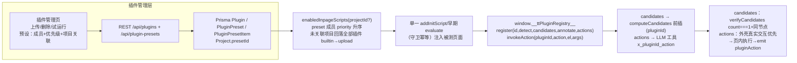

## 产品概述

将测试用例生成工具的主流程升级为 **LLM function call 驱动的智能体模式**，并新建「组件适配插件」生态：既有内置适配（antd / element-plus）落库为内置插件，同时开放**插件管理功能模块**——用户可在独立导航页上传自定义页内脚本插件，提升 AI 生成步骤对 element-ui / antd 类组件库选择器的操作成功率。旧分步实现的回退通过 git 版本历史完成，配置层不留模式开关。

## 本轮新增核心需求（用户确认结论）

- **插件管理独立导航页**（左侧菜单新增「插件管理」）：插件列表、上传导入、试运行预览、删除（内置插件受保护禁删）。
- **自定义插件能力边界＝仅页内脚本，但可注册新的步骤动作**：detect（DOM 特征探测）、candidates（候选定位器增强）、annotate（语义标注）+ **actions（注册新的步骤动作）**。动作是插件提供的页内异步函数（如「日期面板导航翻页」），由平台通用外壳在生成期暴露为 LLM 可调工具并 emit `pluginAction` 步骤、回放期按步骤重放——**Node 侧无任何用户代码**，插件代码 100% 只在被测站点浏览器环境执行，安全边界不变。
- **提供方式＝管理页面用户上传插件代码包**：支持裸 `.js` 单文件直传（推荐主路径，配套填写名称/版本/描述表单）与 `.zip` 代码包（内含 `manifest.json` + 入口 js）两种格式。
- 自定义插件与内置插件共用同一套页内运行时与验证红线：candidates 产出的候选一律经过 `verifyCandidates`（count===1 + isSameNode 同节点）验证后经 `buildLocatorFromCandidate` 落库；actions 由平台外壳统一编排（真实交互优先，页内动作兜底）；插件代码仅在**被测站点的浏览器环境**内执行，管理页需有显著安全提示（全中文）。
- **插件预设 Preset（唯一的注入编排入口）**：preset＝一组有序插件，成员列表顺序即注入优先级（可在编辑器中上下调序）；每个测试项目（Project）选择一个 preset，其生成/回放/Agent 会话按「preset 成员 priority 升序」注入（成员的动作工具也随之进入 LLM 工具清单）；**不设插件全局启用开关——组合即开关**。项目未关联 preset 时回落全部插件按 builtin→upload 顺序注入。启动时 seed 一个 builtin「默认组合」（含 antd / element-plus，禁删），新建项目默认关联它。上传的新插件默认不属于任何 preset，需编辑预设加入后才会生效。

## 日期场景确认（用户问：能否实现「输入 2026-05-04，element 日期选择器自动点击日期翻页、点击相应日期」）

结论＝能，分三层：

1. **主路径零成本**：el-date-picker 输入框可输入，fill('2026-05-04')+Enter 即生效——写进 element-plus 插件知识段「日期选择器优先 fill+Enter」，大多数情况不会发生翻页。
2. **面板点击路径**（不可输入/必须走面板）：element-plus 内置插件注册 `set_date` **步骤动作**示范——页内 action 实现面板导航闭环（点击 prev/next → MutationObserver 等表格刷新 → 校对面板头部年月 → 点击文本匹配的日期格 cell）；fill 优先逻辑由平台外壳先行（Playwright 真实 fill），失败才转页内 action。翻页步数是状态相关的，**不能 emit 固定点击序列落库**——这正是引入 pluginAction 步骤契约的原因。
3. **回放确定性**：emit `{action:'plugin', pluginAction:{pluginId,action,args}}` 复合步骤，runner 内置执行器重放页内 action（同一闭环算法），失败走现有自愈。

## 插件开发者体验（SDK 契约 / 离线验证 / Agent Skill）

用户需求：「插件需定义好输入输出和平台提供的 api 定义，插件开发者脱离平台，仅仅依赖 playwright 可单独开发验证插件，开发者可针对自己项目中的特色组件开发测试插件，提供一个 skill 给开发者，方便开发者使用 ai 编程 agent 生成自己项目中的特色组件的测试插件」。落地三件事：

1. **API 契约正式化（输入输出定义）**：`plugin-api.d.ts` 发布给插件开发者的 TypeScript 声明——`window.__ttPluginRegistry__.register({ id, detect(el), candidates(el), annotate(el), actions? })` 四插槽 + `invokeAction(pluginId, action, el, args)`，附完整 JSDoc（候选形状 strategy/value/role/name/scope、动作签名 `(el, args) => Promise<string>`、平台保证：候选会被 count===1+同节点验证、动作异常隔离、幂等守卫、actions 内合成事件 isTrusted=false 的限制说明）；管理页「开发指南」入口链接到该文档。
2. **脱离平台离线验证（仅依赖 playwright）**：两件套——① `__ttPluginRegistry__` polyfill（零依赖 IIFE，含 actions 注册与 invokeAction，任何页面先注入即可验证，无需启动本平台）；② `server/scripts/pluginHarness.ts`（仅依赖 playwright-core 的 CLI，两种页面来源：`npx tsx scripts/pluginHarness.ts element-plus ./my-plugin.js` **fixture 快捷名**——自动 serve `server/tests/fixtures/` 下的本地页面（内置临时静态服务器规避 file:// 的模块加载限制，`--list` 列出可用页面：antd.html / element-plus.html / element-ui.html / native.html），或 `npx tsx scripts/pluginHarness.ts <url> ./my-plugin.js` 直接验证线上/本地站点；`[--probe]` 追加 annotate 输出与 actions 可调用清单）。输出 JSON 报告 + 控制台表格：每元素候选列表与页内唯一性计数。开发者在自己的项目里 `npm i -D playwright` 即可闭环验证特色组件插件。
3. **Agent Skill 包**：`docs/skills/tt-component-plugin/`（SKILL.md + references/plugin-api.md + references/red-lines.md + examples/ 含 antd-select、element-plus-datepicker（含 set_date action）、自定义组件三个示例插件）——供开发者在 Claude Code / CodeBuddy / Cursor 等 AI 编程 agent 中安装，验收工作流锚定 fixture 页面：采集组件 DOM 样本 → **若特色组件不在现有 fixtures（antd/element-plus/element-ui/native 四页）中，先在 `server/tests/fixtures/` 新建该组件的最小静态页**（含组件库 CDN 引用与一个可交互实例）→ 按模板生成插件（含动作）→ `npx tsx scripts/pluginHarness.ts <fixture名或url> <插件> --probe` 验收（样本页候选 count===1、动作可调用）→ 打包 zip/裸 js 上传管理页。

## 既定共识功能（随本计划一并落地）

- **生成工具回路**：模型自主选择工具（快照/点击/填写/断言/兜底act/结束/插件动作等），动作成功即自动语义化定位并落库为 TestStep；拆分计划降级为大纲软约束注入提示词。
- **人在回路融入循环**：定位连续失败挂起求助（重新描述/AI修正/手动捕获/跳过四选一），人类决策以消息注入方式恢复循环；停止后续跑（steps+messages 序列化持久化）。
- **上下文治理**：单状态槽覆盖式刷新旧快照与旧截图、回灌内容单行化、首尾保护与输入水位观测。
- **三层视觉**：免费稳定等待+遮挡校验+diff 生效确认打底；变化区域反查序号表拼一行事实摘要回灌；视口标注截图常驻随快照发送（fullPage 禁用、devicePixelRatio:1，适配 384 token 固定计价的低分辨率特性），see(region) 区域高清裁剪诊断。

## 技术栈

- 沿用现有栈：Node 后端 Fastify5(ESM/tsx) + Stagehand v4/playwright-core（CDP 桥 pwPage 提供 getBy*/elementHandle/screenshot/evaluate）、OpenAI 兼容网关（deepseek-v4-flash，`openaiModelVision` 主模型多模态）、zod shared schema、Prisma7+SQLite（better-sqlite3 adapter）、React18+antd5+i18n。
- **新增依赖仅一个**：`adm-zip`（纯 JS 零原生模块，`.zip` 插件包解压用；不影响后续 pkg/SEA 打包约束）；像素比对仍自研降采样灰度 hash。

## 实现方案

### 总体架构



### 关键设计与决策

1. **数据模型**：Prisma 新增 `Plugin { id cuid, name unique, version, description, kind:'inpage', entryFile TEXT(js源码), source:'builtin'|'upload', builtin Boolean, createdAt, updatedAt }`（**无全局启用开关**，注入范围完全由 preset 编排）；启动时 `ensureBuiltinPlugins()` 将内置 antd/element-plus 以 `source:'builtin'` upsert 种子（升级友好）；`migrate dev --name add_plugin_table`。Preset 编排另增两表：`PluginPreset { id cuid, name unique, description?, builtin Boolean, createdAt, updatedAt }` 与 `PluginPresetItem { presetId, pluginId, priority Int, unique([presetId, pluginId]) }`，`Project.presetId?`（onDelete: SetNull）；`migrate dev --name add_plugin_preset`。
2. **上传协议**：multipart 表单（元数据字段 name/version/description + 文件）。`.js` 直传为主路径：文件内容存 entryFile；`.zip` 解包校验 `manifest.json`(id/name/version/description/entry) 取入口源码，成员数量与总量≤512KB、缺 manifest/入口不存在/超限均返回明确中文错误；Node 侧 `new Function(code)` 仅做语法快速校验不执行。
3. **REST API**（routes/plugins.ts 参照 settings.ts 注册风格）：`POST /api/plugins/upload`、`GET /api/plugins`、`PATCH /api/plugins/:id`（description）、`DELETE /api/plugins/:id`（builtin 返回 403）、`POST /api/plugins/:id/test {url}` —— 仿 locatorPickerService 会话生命周期：headed 浏览器 → 注入该插件与框架脚本 → 打开目标 URL → 收集 detect/candidates 执行日志、actions 清单与命中统计返回 `{detectHit, candidatesCount, actions[], log[]}` 后关会话。
4. **页内运行时框架**：FRAMEWORK 片段定义 `window.__ttPluginRegistry__`：`register({id, detect, candidates, annotate, actions})` 四插槽（幂等守卫、异常隔离——单个插件抛错不污染主链路）+ `invokeAction(pluginId, action, el, args)` 转发器；`locatorCandidateScript.computeCandidates` 在生成通用九策略候选前依次调用各成员插件的 `candidates(el)` 并给候选附 `pluginId` 标记；findModalScope 硬编码 `.ant-modal/.el-dialog` 迁入内置插件回调。
5. **注入管道（Preset 为唯一编排入口）**：服务端 helper `enabledInpageScripts(projectId?): string[]` —— 项目关联 preset 时按「preset 成员 priority 升序」返回成员源码；未关联项目回落全部插件按 builtin→upload 顺序。generationService（GenerateParams.projectId 现成）/ runnerService 与 agentService（经 testCaseId→projectId 推导）/ locatorPickerService 调用方统一传项目上下文；会话拼接仍走「FRAMEWORK + 各成员插件」单一 init script（同 PICKER_SCRIPT 先例）；preset 增删/成员调整即时入库，下次浏览器会话生效（不做热更新）。REST 增 `GET|POST /api/plugin-presets`、`PATCH|DELETE /api/plugin-presets/:id`（builtin 403；成员以有序 pluginIds 数组保存为 priority）。
6. **插件动作注册与步骤契约（新增）**：插件 `actions: { [name]: (el, args) => Promise<string> }`（页内异步函数，参数为已定位元素 + 自由 args 对象）。平台通用外壳三段式：

- **生成期**：buildGenTools 收集 preset 内各插件 actions，注册为 LLM 工具 `x_<pluginId>_<action>`（description 由插件提供 actionDoc；parameters 统一 `{selector, value?, args?}`）；
- **执行**：外壳 = 索引解析 → elementFromPoint 遮挡校验 → **真实交互优先**（若 action 声明 `preferFill: true` 则先 Playwright fill+Enter）→ 失败转页内 `invokeAction`（Promise 等待，超时上限 10s）→ 成功 emit TestStep；
- **落库/回放**：emit `{action:'raw' 拆分为专用 pluginAction 步骤}`——`shared/testScript.ts` 扩展 optional `pluginAction: { pluginId, action, args? }` 字段（action:'plugin'）；runnerService 遇 pluginAction 步骤 → 页面已按 preset 注入该插件 → 同一 `invokeAction` 重放（超时/缺失插件报错并指引）→ 失败走现有自愈。

7. **循环引擎改造**：AgentTool 加 `stateful?: 'snapshot'|'screenshot'`，push 新结果前将历史同槽消息 content 原地改写为一行占位（Set 维护 tool_call_id）；`onFailure(name,args,error)=>string|null` 钩子（null 照常回灌自愈，string 为人工介入替换结果）；回灌单行化上限 400 字符（snapshot/stateful 除外）；首条 user 永不动 + 最近 3 轮保原文 + inputTokens 水位触发中间压缩（summarizeSteps 作免费摘要源）。
8. **动作工具统一外壳**（genToolHost）：数字索引→xpathMap 解析（沿用 agentService.resolveSelector 先例）→ 真实执行 → `document.elementFromPoint` 遮挡校验（命中 .ant-modal-mask/.el-overlay 类遮罩时回灌提示先关弹层）→ `semanticizeLocator(mode='playwright')` → buildDirectStep 自动 emit（instruction 必填供回放自愈）→ 回灌「已记录为第N步」+ diff 事实摘要；失败尝试天然不入库；wait 工具多帧 hash 稳定等待（上限 3s）替代固定 600ms。
9. **人回路=消息注入**：AssistDecision 四出口映射为 `{role:'user'}` 重描述注入 / AI修正直执 emit 回灌 / CapturedEvent 经 buildCapturedStep emit 回灌 / 跳过回灌另寻路径；连续≥3 次同一目标失败挂起 gen:assist；steps+messages 序列化入 GenerationLog meta（必要则补 prisma 迁移），pauseJob abort 后 continueGenerate 读回续跑，replanAfterRevoke 维持起新 loop 现状。
10. **视觉层**：`openaiModelVision===true` 才注册 see 工具；snapshot 同 result 组装 DOM 序号树+视口标注截图（粗边框≥3px 白底序号块，参数经 1080p 真网关基线实测写入注释）；本地 hash 未变跳过发图；see(region) 发变化 bbox 高清裁剪（恒 384 token 计价下以裁剪换 DPI）。
11. **红线**：index/xpathMap 仅生成期临时引用，落库产物永远是语义 locator 或平台契约内的 pluginAction 步骤；candidates 一律过 verifyCandidates；**外壳与原子动作一律 Playwright 真实交互**；插件 actions 内部的合成事件（el.click()/dispatchEvent）由插件作者自担并在文档明示（页内无法产生可信事件 isTrusted=false，对自家组件通常可用，但优先用外壳真实交互）；WS gen:* 事件契约与生成链路前端行为不变；全中文界面。

## 目录结构

```
test-tool/
├─ server/
│  ├─ prisma/schema.prisma                        # [MODIFY] +Plugin(无启用开关) / PluginPreset / PluginPresetItem / Project.presetId；migrate add_plugin_table + add_plugin_preset
│  ├─ src/shared/testScript.ts                    # [MODIFY] TestStep 增 optional pluginAction{pluginId,action,args}；action 枚举 + 'plugin'
│  ├─ src/services/pluginStore.ts                 # [NEW] enabledInpageScripts(projectId? 含 preset 编排)、ensureBuiltinPlugins + seed「默认组合」、源码语法快检
│  ├─ src/routes/plugins.ts                       # [NEW] upload/list/PATCH(描述)/DELETE(builtin 403)/test 试运行会话 + presets CRUD（仿 locatorPickerService 会话）
│  ├─ src/index.ts                                # [MODIFY] 注册 routes/plugins；启动时 ensureBuiltinPlugins()
│  ├─ src/services/toolLoop.ts                    # [MODIFY] AgentTool.stateful 标记+历史同槽原地降级；onFailure 钩子；单行化；首尾保护+水位压缩
│  ├─ src/services/generationToolHost.ts          # [NEW] GenToolContext{jobId,stagehand,page,pwPage,xpathMap,envMap,sysVars,steps,lastShotHash}；buildGenTools 全套工具+插件动作工具(x_pluginId_action)；actionShell（索引解析→遮挡校验→semanticizeLocator→自动emit→diff摘要回灌）；wait 稳定等待
│  ├─ src/services/visualFrameService.ts          # [NEW] 视口截屏(dpr=1)+帧hash去重缓存+region裁剪+前后两帧降采样灰度diff+bbox反查序号
│  ├─ src/services/runnerService.ts               # [MODIFY] pluginAction 步骤重放分支（页内 invokeAction，失败走自愈）
│  ├─ src/services/generationService.ts           # [MODIFY] generate() 整体换 runToolLoop 执行器（大纲软约束注入、act 兜底平移 L1025-1095、assist 四出口、continueGenerate 读回 messages、replanAfterRevoke 适配）；会话按项目 preset 注入 enabledInpageScripts
│  ├─ src/services/locatorCandidateScript.ts      # [MODIFY] FRAMEWORK(__ttPluginRegistry__：四插槽+invokeAction)并入 CANDIDATE_SCRIPT；computeCandidates 前插插件候选(pluginId)；扩展 __ttCollectInteractive 编号+*[n]*新元素标记与 __ttDrawOverlays 标注绘制
│  ├─ src/services/componentPlugins/             # [NEW] antd.ts(select_option/set_date actions+Form.Item label 收割+.ant-modal 迁入)、elementPlus.ts(el-select 判定+set_date 面板导航 action+el-form-item label)；registry.ts 类型与注册辅助（内置侧）
│  ├─ package.json                                # [MODIFY] +adm-zip
│  ├─ scripts/pluginHarness.ts                    # [NEW] 仅依赖 playwright-core 的插件离线验证 CLI：注入 polyfill+插件→全页可交互元素逐个 detect/candidates→JSON 报告+控制台表格（--probe 加 annotate 与 actions 清单）
│  ├─ src/types/plugin-api.d.ts                   # [NEW] 对外发布的插件契约声明（四插槽输入输出、invokeAction、PickCandidate 形状、平台保证与 isTrusted 限制 JSDoc）
│  └─ tests/                                      # [MODIFY] +pluginStore.test/contextRewrite.test/genToolHost.test/pluginInject.test/pluginPreset.test/pluginAction.test；fixtures/ 已有 antd|element-plus|element-ui|native.html（插件 harness 验证数据源，按需补组件实例）
├─ src/
│  ├─ pages/Plugins.tsx                           # [NEW] 插件管理页（插件列表 + 「预设」Tab，详见 design）
│  ├─ pages/Projects.tsx                          # [MODIFY] 项目新建/编辑表单增加「组件预设」下拉选择
│  ├─ App.tsx                                     # [MODIFY] 左侧 Menu 追加「插件管理」+ Route 挂接（沿用现有导航组织）
│  ├─ api/client.ts                               # [MODIFY] plugins + plugin-presets 的列表/上传/patch/delete/test fetch 封装
│  └─ i18n/locales/{zh-CN,en-US}.ts               # [MODIFY] 插件管理与预设词条（zh-CN 补齐为准，en-US 兜底）
└─ docs/
   ├─ …/README.md                                 # [MODIFY] 架构说明同步（可选）
   └─ skills/tt-component-plugin/                 # [NEW] Agent Skill 包：SKILL.md（引导 agent 采集组件 DOM 样本→按模板生成插件含动作→harness 验收→打包上传）+ references/(plugin-api.md|red-lines.md) + examples/(antd-select|element-plus-datepicker 含 set_date|custom-component).js
```

## 设计说明

插件管理页遵循现有中后台视觉体系（Layout 左侧菜单 + 内容区卡片，antd5 ConfigProvider zhCN，与 Settings 页一致的信息密度与间距节奏），不引入新的视觉语言。

### 区块规划

- **顶部工具区**：标题「插件管理」+ 一行 antd Alert(info) 安全说明：「插件代码将在被测网站的浏览器环境中执行，请仅在理解其内容后启用」（全中文、不可关闭置顶）；右侧「上传插件」主按钮打开 Drawer；页头 Tabs 切换「插件」「预设」两个区块。
- **插件列表区**：Table（分页 ≤10 行不必虚拟滚动）列＝名称/版本(小字灰)/来源 Tag(upload 上传 | builtin 内置，蓝/紫双色系区分)/**所属预设**(Tag 列表或计数，空时灰色 tooltip「未加入任何预设，暂不会被注入」)/**动作数**(badge，悬停列出动作名)/描述(SEllipsis 悬浮展开)/操作列＝「试运行」链接按钮 + Popconfirm 删除（builtin 行删除禁用并 tooltip「内置插件不可删除」）。空状态 Empty 引导「上传第一个插件」。
- **预设 Tab 区**：preset 列表 Table（名称/成员数(badge)/来源 Tag/关联项目数/操作[编辑|删除 Popconfirm，builtin 禁删]）；「新建预设」按钮打开编辑 Drawer——名称+描述 + 成员编排 List（左侧全部插件多选加入，右侧已选成员列表每行「上移/下移/移除」调整 priority，首行序号即注入优先级，行尾展示该插件动作 badge）；保存调 POST/PATCH 传有序 pluginIds 数组。内置「默认组合」不可编辑成员与删除，仅查看。preset 是唯一生效编排：加入/移出成员即改变项目注入范围与 LLM 可用动作。
- **上传抽屉 Drawer**：Form(name 必填/版本默认 1.0.0/描述 TextArea 选填)+ Upload.Dragger（accept=".js,.zip" 单文件、beforeUpload 校验体积≤512KB 即时提示）+「保存并加入预设」提交（可选目标 preset，默认不加）。
- **试运行交互**：点击后行内 loading + Modal 展示结果（目标地址输入框预填当前 URL）；成功展示 detectHit、候选数、actions 可调用清单与日志列表，失败红字展示错误详情，全程 message 反馈。
- **项目表单联动**（Projects 页）：新增/编辑项目时「组件预设」Select 列出全部 preset（builtin 默认组合置顶），保存写 Project.presetId；项目详情/生成页脚注显示当前生效预设名、成员与动作清单，便于排查注入范围。

### 交互细节

表格行悬停浅灰底；保存/删除失败 message.error 并回滚乐观态；所有按钮 Loading 态防重复提交；预设成员上下移为乐观排序、保存时统一提交；移动性无诉求（桌面 Webview 应用）。