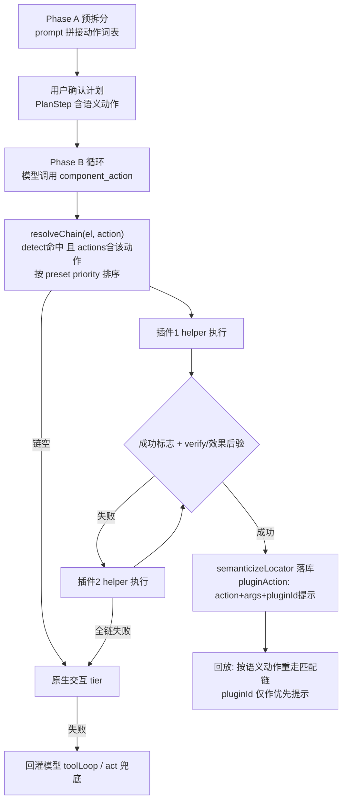

## 产品概述

将测试脚本生成引擎的插件机制升级为「语义动作层」架构：LLM 只负责输出动作意图（语义动作名 + 目标元素 + 参数），运行时负责决定由谁执行、如何执行、失败如何降级。内置插件按组件能力精细化拆分为「选择插件」与「日期选择插件」，原框架级插件（antd/element-plus）移除，其组件相关能力并入对应能力插件。

## 核心功能

- **语义动作分发链**：生成与回放时按元素特征（detect 命中）+ 动作注册（actions 中存在该动作）过滤插件，按 preset 优先级升序逐个尝试；动作注册表即能力声明，不新增 supports 字段
- **动作结果协议与后验**：插件动作返回 success/failed/uncertain 三态（string 返回=成功，throw=失败，保持向后兼容）；支持插件级 verify 页内后验；平台统一用页面效果哈希做兜底校验，不轻信插件自述
- **三级降级**：插件匹配链逐个尝试 → 原生 Playwright 交互（selectOption/fill+Enter/click 序列）→ 回灌 LLM 走现有自愈/act 兜底
- **动作词表接入预拆分**：已启用插件注册的动作动态拼入预拆分 prompt，计划确认阶段即可见组件级语义动作；PlanStep.action 扩展为开放枚举
- **统一 component_action 工具**：替换现有逐插件 x_ 工具列表，工具数量与插件数量解耦，降低 token 与模型混淆
- **内置插件精细化（最终 2 个）**：select 选择插件（detect 命中 .ant-select/.el-select 且排除下拉弹层，动作 select_option，含 combobox role 候选与组件范围 label 收割、「非原生 select 勿 fill」标注）；date-picker 日期选择插件（detect 命中 .ant-picker/.el-date-editor，动作 set_date，fill 优先失败走面板导航）；多框架变体在插件内部分发
- **旧脚本兼容**：落库步骤中 pluginId 转为可选命中提示，回放按语义动作重走匹配链；存量库中旧 antd/element-plus 插件行与 preset 引用做清理中和
- **界面展示**：计划确认与步骤表以中文语义动作名展示，全中文界面

## Tech Stack

- 后端：Node.js + Fastify 5 + TypeScript（现有），Prisma 7 + SQLite（无 schema 变更，复用 Plugin.actions Json）
- 页内插件：零依赖 IIFE 脚本 + 现有 pluginRuntime 注册表体系
- LLM：OpenAI 兼容网关 + 现有 toolLoop function call 循环
- 前端：React 18 + Vite + antd（仅展示层小改 + i18n）

## Implementation Approach

分层职责：**意图层（LLM）→ 分发层（resolveChain）→ 执行层（插件 helper / 原生交互）→ 后验层（verify / effectChanged）→ 落库回放（语义动作 + pluginId 提示）**。

关键决策（已与用户确认）：

1. 匹配链过滤条件 = `detect(el) 命中 && actions[action] 存在`，排序 = preset priority 升序；注册表即能力声明
2. 结果协议向后兼容：string=success、throw=failed、对象形式三态；无 verify 时用现有 shotHash/effectChanged 做效果后验
3. Phase B 工具收敛为单一 `component_action(action, selector, value, args, instruction)`，词表写入 description
4. 落库 `TestStep.pluginAction.pluginId` 改为可选提示，回放按链重匹配——旧步骤 `{pluginId:'antd', action:'select_option'}` 的 action 名本就是语义名，兼容几乎零成本
5. 内置插件页内脚本复用现有 select_option/set_date 完整实现（弹层选择、面板翻页闭环），仅重组织打包粒度

性能考量：匹配链为 O(n) 插件过滤（n=preset 成员数），verify/效果后验仅在成功路径执行一次；词表 prompt 段只拼当前 preset 已启用插件且限长；工具数从 N插件×M动作 降为 1。



## Directory Structure Summary

后端 8 个文件修改，前端 3 个文件小改，无新增文件、无 DB schema 变更：

```
server/src/
├── types/plugin-api.d.ts                  # [MODIFY] PluginActionResult 三态协议、PluginActionDef.verify 可选字段、TtPluginRegistry.resolveChain 签名、对外文档更新
├── services/pluginRuntime.ts              # [MODIFY] 实现 resolveChain（过滤+排序）、invokeAction 结果归一化（string/throw/对象）
├── services/componentPlugins/builtin.ts   # [MODIFY] 重写为 SELECT_INPAGE/DATE_PICKER_INPAGE 两插件：迁移 select_option/set_date 完整实现、combobox role 候选、组件范围 label 收割、annotate；BUILTIN_PLUGIN_DEFS 仅含 select/date-picker；BUILTIN_PRESET_MEMBERS=['select','date-picker']
├── services/pluginStore.ts                # [MODIFY] ensureBuiltinPlugins：修复 update 分支 actions 不清除问题、删除旧 antd/element-plus builtin 行（cascade 清 preset 引用）、preset 成员同步逻辑；新增 enabledActionVocabulary(projectId)
├── services/genToolsPlugin.ts             # [MODIFY] buildPluginActionStep 的 pluginId 改可选；pluginToolName 移除
├── services/generationToolHost.ts         # [MODIFY] 删除 x_ 工具循环，新增统一 component_action 工具 + 分发器（链→verify/效果后验→原生 tier→回灌）+ emit 语义动作步骤
├── services/generationService.ts          # [MODIFY] PlanStep.action 开放枚举（zod 放宽+词表校验）、DEFAULT_SPLIT_SYSTEM_PROMPT 动态拼接【组件语义动作】段、replanAfterRevoke 同步适配
├── services/runnerService.ts              # [MODIFY] 'plugin' 回放分支改按语义动作链重匹配（pluginId 优先尝试），失败走现有自愈
└── shared/testScript.ts                   # [MODIFY] TestStep.pluginAction.pluginId 改可选
src/
├── components/StepsTable.tsx              # [MODIFY] 语义动作名中文化展示
├── pages/Generate.tsx                     # [MODIFY] 计划确认列表展示语义动作
└── i18n/locales/zh-CN.ts                  # [MODIFY] 新增语义动作词条
```

## Key Code Structures

核心契约（插件协议与分发入口，多模块依赖）：

```typescript
/** 动作结果三态协议：string 返回视为 success（向后兼容），throw 视为 failed */
export interface PluginActionResult {
  status: 'success' | 'failed' | 'uncertain';
  message: string;
}

export interface PluginActionDef {
  fn: (el: Element | null, args: Record<string, any>) => Promise<string | PluginActionResult>;
  /** 可选页内后验：成功后校验终态（如选中项文本），不过视同 failed 进入下一插件 */
  verify?: (el: Element | null, args: Record<string, any>) => Promise<boolean> | boolean;
  doc: string;
  preferFill?: boolean;
}

/** TtPluginRegistry 新增：匹配链解析（detect 命中 且 actions[action] 存在，注册顺序即优先级） */
resolveChain(el: Element, action: string): { id: string; variant?: string }[];
```

## Agent Extensions

### SubAgent

- **code-explorer**
- Purpose: 在修改 shared/testScript.ts（TestStep.pluginAction.pluginId 改可选）与 PlanStep.action 开放枚举前，全面扫描前后端对 TestStep.pluginAction、PlanStep、x_ 工具的所有消费点，防止 shared schema 改动遗漏调用方
- Expected outcome: 输出完整调用点清单（文件+行号），确保 gen-dispatcher 与 frontend-action-display 任务无回归盲区