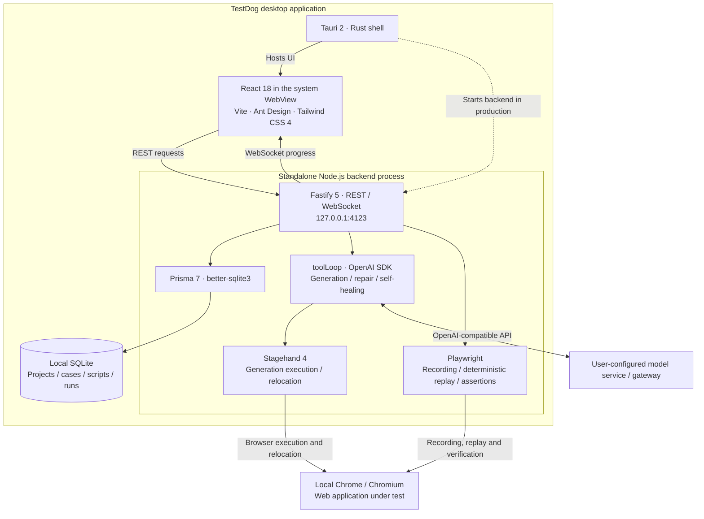

# TestDog Test Case Management Tool

[简体中文](README.md) | English

A desktop test case management tool built on a **Tauri 2 + React 18 + Ant Design + Tailwind CSS 4** desktop shell and a **Fastify 5 + Prisma 7 + SQLite + Stagehand 4 + Playwright** Node backend:

1. **AI script generation**: natural language (with attachments / login profiles) → model-proposed step plan → after confirmation, executed step-by-step in a real browser via a tool-calling loop → each step lands as a semantic-locator script; supports pause & resume, AI repair, and manual takeover
2. **Manual recording**: record with Playwright codegen → parsed into structured steps
3. **Replay runs**: deterministic Playwright replay (zero LLM cost) with UI / API / WebSocket assertions, self-healing on failure + one-click adoption back into the script
4. **Plugin system**: component-library semantic action plugins (dropdown / tree select / cascader / date / time / slider) + preset orchestration, across **Ant Design / Element (element-ui · element-plus) / Vant / MUI**

## Comparison with OpenClaw

**TestDog fits reusable Web test cases, scripts, and regression reports; OpenClaw fits everyday tasks spanning tools and chat channels.** OpenClaw is a self-hosted AI assistant with messaging integrations and tool/skill extensions. See the [official introduction](https://docs.openclaw.ai/).

| Area | TestDog | OpenClaw |
| --- | --- | --- |
| Test workflow | Built-in projects, cases, script versions, batch runs, and reports | General assistant workflows; equivalent test management can be assembled with tools, skills, and external test systems |
| Browser interaction | Generate or record editable steps, then replay them | Browser snapshots, clicks, typing, and screenshots for web tasks; see [browser tools](https://docs.openclaw.ai/tools/browser) |
| Verification | UI, API, and WebSocket assertions, failure screenshots, and console/network records | Evidence can be collected with browser and other tools; assertions and reports depend on the configured workflow |
| Extensions | Component-library actions for generating and replaying complex form interactions | General tools, skills, messaging integrations, and [scheduled automation](https://docs.openclaw.ai/automation/cron-jobs) for cross-service tasks |

**TestDog advantages**

- **Reusable test assets**: edit, version, and batch-replay generated or recorded scripts without describing the entire flow again.
- **No LLM calls for ordinary replay**: Playwright executes saved scripts; only repair and self-healing require model calls, lowering regression testing costs.
- **Integrated test evidence**: steps, assertions, failure details, and reports reduce the need to assemble separate test-management tools.

**TestDog limitations**

- **Narrower task coverage**: focused on Web testing, without OpenClaw-style multi-channel assistant entry points or general task orchestration.
- **Scripts still need maintenance**: changes to pages or business flows may require re-recording, assertion updates, or human review of AI repairs. Deterministic replay does not guarantee success.
- **Limited built-in component coverage**: custom controls and complex pages may require additional plugins or manual intervention.

This is a use-case assessment based on current project features and OpenClaw documentation checked on 2026-09-09, not a performance or success-rate benchmark. OpenClaw can be extended for testing; evaluate both against your actual workflow.

## Architecture



> Stagehand / Prisma are Node libraries that cannot run inside Tauri's Rust/Webview, so TestDog uses a "Tauri shell + standalone Node backend process" split: in development `concurrently` starts the backend + Vite and the Tauri window loads Vite; in production the backend is bundled to a single file with `tsup` and shipped inside the installer with a bundled Node runtime (end users don't need Node installed).

## Directory Structure

```text
TestDog/
├─ src/                # React frontend (pages/ components/ i18n/ api/ utils/)
├─ server/             # Node backend (Fastify + Prisma + Stagehand + Playwright)
│  ├─ prisma/schema.prisma
│  ├─ src/routes/      # REST + WS routes (projects/testCases/scripts/generate/runs/record/attachments/loginConfigs/plugins/generationLogs/locator/settings)
│  ├─ src/services/    # generation / replay / recording / plugins / attachments / locator services (componentPlugins/ built-in plugins; sources/ holds single-file in-page sources)
│  ├─ src/toolLoop.ts  # shared LLM tool-calling loop (generation / self-heal)
│  ├─ src/migrate.ts   # idempotent production-DB migration (auto-patches old DBs on upgrade)
│  └─ tests/           # vitest
├─ scripts/            # packaging scripts (dist.mjs / build-dmg.mjs / prepare-sidecar.mjs)
├─ doc/                # VitePress help-doc site (bilingual zh / en)
└─ src-tauri/          # Tauri shell (Rust + resources/ sidecar resources)
```

## Development Setup

```bash
# 0. Clone
git clone https://github.com/xianyongwen/TestDog.git
cd TestDog

# 1. Install dependencies (root + backend)
npm install
npm --prefix server install

# 2. Initialize the database (first time only; an empty DB may run migrate dev once.
#    Do NOT use migrate dev / db push for later schema changes — see the note below)
npm --prefix server run prisma:generate
npm --prefix server run prisma:migrate -- --name init

# 3. Download the browser (first time; used by Playwright/Stagehand)
npm --prefix server exec -- playwright install chromium

# 4. Start the desktop app (Tauri window + auto-started backend + Vite)
npm run tauri dev
```

> Web-only debugging also works: `npm run dev` (backend on :4123 + frontend on :1420, open `http://localhost:1420`).
>
> **Schema change flow** (see the header comment in `server/src/migrate.ts`): `prisma generate` to regenerate the client → patch the dev DB with idempotent better-sqlite3 SQL → append an idempotent entry to `MIGRATIONS` in `migrate.ts`. After dev.db exists, do **not** run `prisma migrate dev` / `db push` (the self-managed `_app_migrations` table is detected as drift, causing a reset/drop).

## AI Gateway Configuration

AI generation and self-healing need an LLM, called via the **OpenAI-compatible protocol** through a custom gateway/proxy; default model `deepseek-v4-flash-vision-exp`. Fill in the left sidebar's "**Settings**" page:

- **Gateway URL / API key / model name**
- **Model has vision**: when enabled, image attachments and page screenshots go to the main model multimodally, and the generation loop gains a `see` visual-observation tool (disabled = no images are sent)
- **Reasoning effort** (maps to the gateway's reasoning-strength parameter; keep off for non-reasoning models)
- **Agent max steps**, **browser path** (empty = auto-detect system Chrome), **step-split prompt** (restorable to default), **generation-log retention days**
- **Appearance** (Light / Dark / Follow system), **font size** (Small / Medium / Large), **UI language** (简体中文 / English)

A `.env` fallback in `server/` also works (note: empty values cause import errors — leave commented instead):

```env
OPENAI_API_KEY=sk-xxxx
OPENAI_BASE_URL=https://your-gateway.example.com/v1
OPENAI_MODEL=deepseek-v4-flash-vision-exp
```

## Core Features

- **AI script generation**: "AI Generate" on the case page → natural language + start URL, with attachments (text auto-extracted; images compressed and sent multimodally to the main model) and login profiles (generates with an already-logged-in storageState). The model first proposes a step plan for confirmation, then a tool-calling loop executes step-by-step in a real browser (snapshot / click / fill / select / assert / see / api tools); each successful action is resolved into a semantic locator and persisted; when locating gets stuck the run suspends for help (AI repair / rephrase / manual takeover / skip); pause and "continue generation" later.
- **Manual recording**: enter a start URL → operate in the popped-up Playwright recording browser → "stop and import" parses into editable steps; "login profiles" record login states for reuse in generation and replay.
- **Replay runs**: one-click run of any script version, deterministic Playwright replay (zero LLM cost); UI assertions (visible / hidden / text / URL), API assertions (status code / response body / JSON field), WebSocket assertions (send / receive message); failed locators auto self-heal and can be adopted back into the original script in one click; failed steps auto-capture screenshots plus console/network; results export to JSON / Excel; **headless batch runs** of a project's cases are supported.
- **Plugin system**: built-in plugins are split by "framework × capability domain" — dropdown `select`, tree select, cascader, date `set_date`, time `set_time`, slider `set_value` — covering **Ant Design / Element (element-ui · element-plus) / Vant / MUI** (native `<select>` is handled by the dispatcher's native-interaction fallback selectOption); actions follow a tri-state result protocol + in-page post-validation of end states, blocking "clicked but not actually selected" false successes; upload custom plugins (.js/.zip); "Presets" orchestrate injection order (action vocabulary + in-page scripts injected during generation/replay); the built-in plugins' sources are themselves single-file in-page scripts (`sources/*.js`) that can be read, modified, and used as development examples.
- **Generation logs**: every generation keeps step-level logs (tool calls, visual observations, help decisions) and token usage accounting (per-step details, cache hits), auto-cleaned on startup per retention days.
- **More**: single / bulk import & export of `.testcase` files; drag-sort cases, batch-set default script versions, and export a **test report** (Excel with per-run step details / console / network / token) after batch runs; two skill packages + test-friendly code rules for coding agents (generate-testcase for importable cases, tt-plugin-from-source for generating plugins from project source); system variables for unique test data (random phone / email / ID number); bilingual UI (Chinese / English).

## Technical Notes

- Stagehand 4 (`@browserbasehq/stagehand`, local mode `env: "LOCAL"`) drives generation-time browser execution and self-healing relocation; the replay engine uses `playwright-core` for deterministic execution, with self-heal re-attaching via CDP to the same browser to re-locate.
- The LLM loop is the in-house `toolLoop` (openai SDK, OpenAI-compatible gateway), shared by generation, self-heal locating, and AI repair; token usage is booked differentially at the gateway client layer.
- Built-in component plugins are split by "framework × capability domain" into single-file in-page scripts (`server/src/services/componentPlugins/sources/`, shipped with the build under `dist/sources/`); at runtime, plugins matching the same component form a match chain in preset member order (earlier tries first, stops on success) — the `detect/candidates/annotate/actions` four-slot semantics are documented on the docs site's "Plugin Development" page.
- Prisma 7: datasource URL in `prisma.config.ts`, SQLite via the `@prisma/adapter-better-sqlite3` driver adapter, generator `prisma-client`.
- Recording spawns a `playwright codegen` subprocess; `parseCodegen` parses it into structured steps (unmatched lines kept in `raw` so nothing is dropped).
- Attachment normalization is zero-LLM: xlsx (sheetjs) / pdf (pdf-parse) / docx (mammoth) / csv / json plain-text extraction; images are compressed with compressorjs, the original saved, and sent multimodally to the main model during generation.
- Browser viewport is uniformly 1920×1080; production uses system Chrome (`--channel=chrome`).
- Frontend: i18next bilingual (zh-CN / en-US), Tailwind CSS 4 + Ant Design 5 styling, theme and font size apply instantly from Settings.

## Production Packaging

```bash
npm run dist        # scripts/dist.mjs: macOS .app/.dmg, Windows NSIS installer
```

1. `scripts/prepare-sidecar.mjs` first bundles the backend to a single file with `tsup`, prunes production dependencies, and copies the Node runtime and `app.db.template` into `src-tauri/resources/`. **After any schema change you must re-run it and commit the artifacts `resources/server/index.js` + `app.db.template`**, or the installed app errors with `Unknown field` at startup.
2. macOS: `tauri build` produces .app/.dmg (`build-dmg.mjs` deduplicates/falls back); Windows: NSIS installer (TEMP is redirected to the project drive during packaging to avoid makensis failures from low system-disk space).
3. The production DB is created by copying `app.db.template` on first run; upgrades never overwrite the old DB — the idempotent migration in `server/src/migrate.ts` auto-patches columns at startup.

## Docs & Contributing

- **Help docs**: <https://softwing.top/testdog-doc/> (sources in `doc/`, VitePress, bilingual zh/en; preview locally with `npm --prefix doc install && npm --prefix doc run dev`)
- **Contributing**: see [CONTRIBUTING.md](CONTRIBUTING.md) (branch model / commit convention / schema-change flow / PR process)
- **Security**: do not open public issues; use GitHub private vulnerability reporting, see [SECURITY.md](SECURITY.md)
