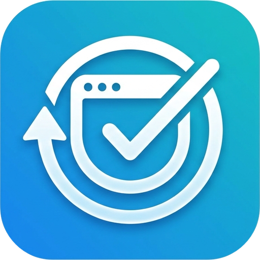
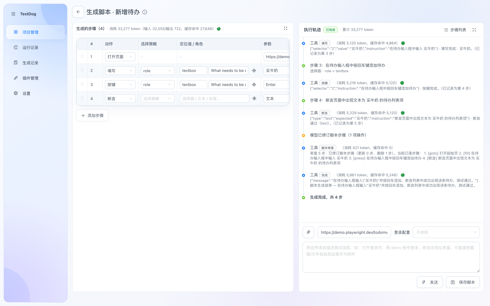
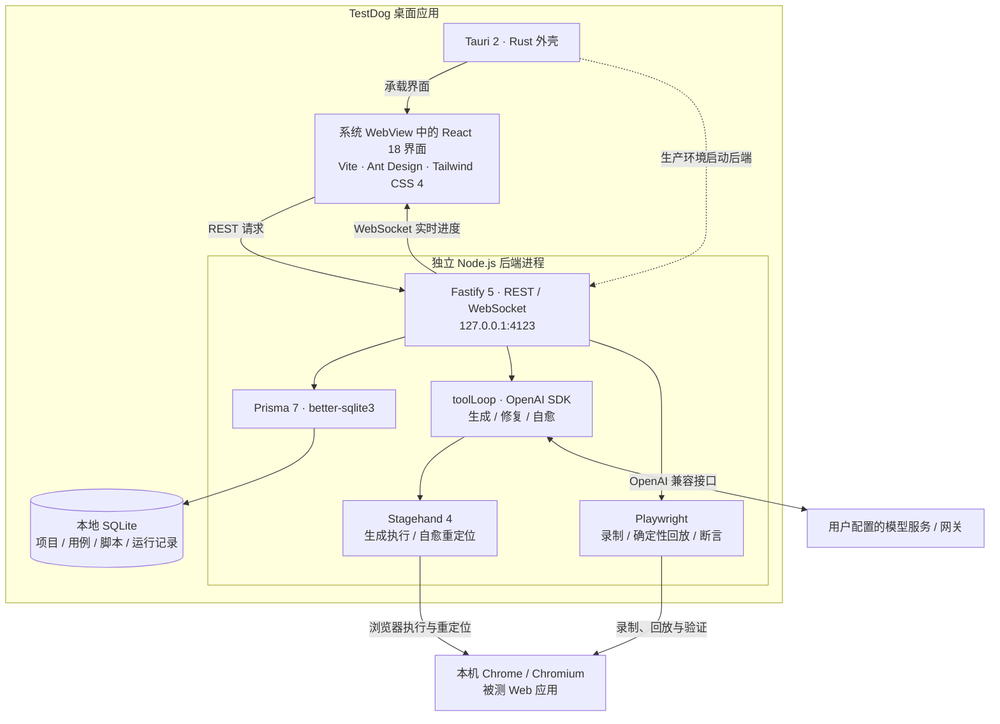

# TestDog

> 面向 Web 回归测试的本地桌面工具：用自然语言描述流程，确认 AI 生成的步骤后保存为可编辑的 Playwright 脚本，之后可确定性回放。

<div align="center">
  
</div>

简体中文 | [English](README.md)

[下载最新版安装包](https://github.com/xianyongwen/TestDog/releases/latest) · [快速开始](https://softwing.top/testdog-doc/guide/getting-started) · [帮助文档](https://softwing.top/testdog-doc/) · [GitHub](https://github.com/xianyongwen/TestDog)



短视频演示：[AI 生成（36 秒）](doc/docs/public/videos/ai-generate.mp4) · [确定性回放（18 秒）](doc/docs/public/videos/replay-run.mp4)

## 为什么是 TestDog

TestDog 的目标不是让 AI 临时替你点一次网页，而是把一次浏览器流程沉淀成可复用的测试资产：

- **描述或录制**：用自然语言生成测试，或用 Playwright codegen 手动录制。
- **确认后保存**：先检查模型给出的步骤计划，再将每个动作保存为可编辑的语义定位器步骤。
- **无需大模型回放**：保存后的脚本由 Playwright 执行，支持 UI、接口、WebSocket 断言、项目批量回归和证据导出。
- **失败时再修复**：定位器失效时，才请求模型提出受控修复建议；确认后再采纳回写脚本。

## 哪些操作需要 AI，哪些不需要？

| 流程 | 是否需要 LLM | 说明 |
| --- | --- | --- |
| AI 生成脚本 | 是 | 自然语言、附件、截图和浏览器动作通过用户配置的 OpenAI 兼容网关处理。 |
| 定位器修复 / 自愈 | 仅触发时需要 | 保存的定位器失败后，模型用于寻找或提出替代定位器。 |
| 手动录制 | 不需要 | 由 Playwright codegen 录制浏览器操作。 |
| 普通回放与断言 | 不需要 | 已保存步骤由 Playwright 确定性执行；UI、接口和 WebSocket 检查不会调用 LLM。 |
| 批量回归与报告 | 不需要 | 复用已保存脚本运行，并生成截图、console/network 证据以及 JSON / Excel 报告。 |

AI 生成和修复使用用户配置的模型网关。TestDog 以本地为主：项目、脚本、运行记录和日志保存在本地 SQLite；模型请求则按用户配置发送到对应网关。

## 先导入一个示例

下载 `.testcase` 示例文件，在「项目」页面导入：

- [登录流程示例](downloads/skills/generate-testcase/examples/login-flow.testcase)
- [接口 JSON 断言示例](downloads/skills/generate-testcase/examples/api-json-assert.testcase)
- [WebSocket 通知示例](downloads/skills/generate-testcase/examples/websocket-notify.testcase)

## 安装包

[GitHub 最新 Release](https://github.com/xianyongwen/TestDog/releases/latest) 会提供当前可用的 **macOS Apple Silicon**、**macOS Intel** 和 **Windows x64** 安装包。安装包内置 Node.js；浏览器自动化默认使用系统 Chrome，请先安装 Chrome。

首次启动请参考[快速开始](https://softwing.top/testdog-doc/guide/getting-started)，配置 OpenAI 兼容模型网关并运行示例用例。

## 核心能力

1. **AI 生成脚本**：自然语言（可带附件 / 登录配置）→ 模型预拆分步骤计划 → 确认后在真实浏览器逐步执行 → 保存为语义定位器脚本；支持暂停续跑、AI 修复和人工接管。
2. **手动录制**：Playwright codegen 录制操作 → 解析为结构化步骤。
3. **回放运行**：Playwright 确定性回放，支持 UI / 接口 / WebSocket 断言、失败截图、console/network 证据、批量运行和可选的失败自愈。
4. **插件系统**：组件库语义动作插件（下拉 / 树选 / 级联 / 日期 / 时间 / 滑块）+ 预设编排，覆盖 **Ant Design / Element（element-ui · element-plus）/ Vant / MUI**。

TestDog 适合沉淀可复用的 Web 测试用例、脚本和回归报告；它不是通用浏览器助手，也不是托管式云测试平台。

## 架构



> Stagehand / Prisma 都是 Node 库，跑不进 Tauri 的 Rust/Webview，因此采用「Tauri 外壳 + 独立 Node 后端进程」：开发期由 `concurrently` 拉起后端 + Vite，Tauri 窗口加载 Vite；生产期后端 `tsup` 打成单文件、随安装包内置 node 运行时分发（最终用户无需装 Node）。

## 目录结构

```text
test-tool/
├─ src/                # React 前端（pages/ components/ i18n/ api/ utils/）
├─ server/             # Node 后端（Fastify + Prisma + Stagehand + Playwright）
│  ├─ prisma/schema.prisma
│  ├─ src/routes/      # REST + WS 路由（projects/testCases/scripts/generate/runs/record/attachments/loginConfigs/plugins/generationLogs/locator/settings）
│  ├─ src/services/    # 生成 / 回放 / 录制 / 插件 / 附件 / 定位器等核心服务（componentPlugins/ 内置组件插件，sources/ 为单文件页内源码）
│  ├─ src/toolLoop.ts  # 通用 LLM 工具调用循环（生成 / 自愈共用）
│  ├─ src/migrate.ts   # 生产库幂等迁移（升级安装时旧库自动补列）
│  └─ tests/           # vitest
├─ scripts/            # 打包脚本（dist.mjs / build-dmg.mjs / prepare-sidecar.mjs）
├─ doc/                # VitePress 帮助文档站（中英双语）
└─ src-tauri/          # Tauri 外壳（Rust + resources/ sidecar 资源）
```

## 开发运行

```bash
# 0. 克隆仓库
git clone https://github.com/xianyongwen/TestDog.git
cd TestDog

# 1. 安装依赖（根 + 后端）
npm install
npm --prefix server install

# 2. 初始化数据库（首次；空库可跑一次 migrate dev，
#    之后给 schema 加字段不要再用 migrate dev / db push，见下方说明）
npm --prefix server run prisma:generate
npm --prefix server run prisma:migrate -- --name init

# 3. 下载浏览器（首次，供 Playwright/Stagehand 使用）
npm --prefix server exec -- playwright install chromium

# 4. 启动桌面应用（Tauri 窗口 + 自动拉起后端 + Vite）
npm run tauri dev
```

> 也可只跑 Web 调试：`npm run dev`（后端 :4123 + 前端 :1420，浏览器打开 `http://localhost:1420`）。
>
> **schema 变更流程**（见 `server/src/migrate.ts` 头注释）：`prisma generate` 重新生成 client → dev 库用 better-sqlite3 幂等建表/加列 → `migrate.ts` 的 `MIGRATIONS` 追加幂等条目。已有 dev.db 后**不要**跑 `prisma migrate dev` / `db push`（自建 `_app_migrations` 表会被判定为漂移导致 reset/删表）。

## 配置 AI 网关

AI 生成与自愈需要 LLM，通过 **OpenAI 兼容协议**调用自定义网关/代理，默认模型 `deepseek-v4-flash-vision-exp`。进入左侧「**设置**」页填写：

- **网关地址 / 密钥 / 模型名**
- **模型具备视觉能力**：开启后图片附件与页面截图以多模态直发主模型，生成循环提供 `see` 视觉观察工具（关闭则不发送图片）
- **思考深度**（reasoning_effort，映射为网关的推理强度参数；非推理模型保持关闭）
- **智能体最大步数**、**浏览器路径**（留空自动探测系统 Chrome）、**拆步提示词**（可恢复默认）、**生成记录保留天数**
- **外观**（浅色 / 深色 / 跟随系统）、**字体大小**（小 / 中 / 大）、**界面语言**（简体中文 / English）

也可在 `server/.env` 中兜底配置（注意：留空值会导致导入报错，不填则保持注释）：

```env
OPENAI_API_KEY=sk-xxxx
OPENAI_BASE_URL=https://your-gateway.example.com/v1
OPENAI_MODEL=deepseek-v4-flash-vision-exp
```

## 核心功能

- **AI 生成脚本**：用例页「AI生成」→ 输入自然语言 + 起始地址，可传附件（文本自动提取；图片压缩后以多模态直发主模型）、选择登录配置（以已登录 storageState 状态生成）。先由模型预拆分为步骤计划确认，再在真实浏览器的 tool-calling 循环里逐步执行（snapshot / click / fill / select / assert / see / api 等工具），动作成功即解析为语义化定位器落库；定位卡住时挂起求助（AI 修复 / 改述 / 手动接管 / 跳过），支持暂停后续跑「继续生成」。
- **手动录制脚本**：输入起始地址 → 在弹出的 Playwright 录制浏览器里操作 → 「停止并导入」解析为可编辑步骤；「登录配置」可录制登录态供生成与回放复用。
- **回放运行**：任一脚本版本一键运行，Playwright 确定性回放（零 LLM 成本）；支持 UI 断言（可见/隐藏/文本/URL）、接口断言（状态码/响应体/JSON 字段）、WebSocket 断言（发送/接收消息）；选择器失效自动 AI 自愈，可一键采纳回写原脚本；失败步骤自动截图并采集 console/network；结果导出 JSON / Excel；支持项目内用例**批量无头运行**。
- **插件系统**：内置组件插件按「框架 × 能力域」拆分——下拉 `select`、树选择、级联、日期 `set_date`、时间 `set_time`、滑块 `set_value`，覆盖 **Ant Design / Element（element-ui · element-plus）/ Vant / MUI**（原生 `<select>` 由分发器原生交互层兜底 selectOption）；动作遵循三态结果协议 + 页内后验校验终态，拦截「点了但没选上」的假成功；支持上传自定义插件（.js/.zip），「预设」按顺序编排注入（动作词表 + 页内脚本随生成/回放注入），内置插件源码即单文件页内脚本（`sources/*.js`），可直接阅读、修改并作为开发范例。
- **生成记录**：每次生成留步骤级日志（工具调用、视觉观察、求助决策）与 token usage 记账（步骤明细、缓存命中），按保留天数启动时自动清理。
- **其他**：`.testcase` 文件单条 / 批量导入导出；用例列表拖拽排序、批量设置默认脚本版本、批量运行后导出**测试报告**（Excel，含逐运行步骤明细 / console / network / token）；两个技能包与测试友好代码规则下载（供 Claude Code 等编程 agent 使用：`generate-testcase` 生成可导入用例、`tt-plugin-from-source` 从项目源码生成组件插件）；系统变量注入唯一测试数据（随机手机号/邮箱/身份证等）；中英双语界面。

## 技术要点

- Stagehand 4（`@browserbasehq/stagehand`，本地模式 `env: "LOCAL"`）负责生成期浏览器执行与自愈重定位；回放引擎用 `playwright-core` 确定性执行，自愈经 CDP 附加同一浏览器重新定位。
- LLM 循环为自研 `toolLoop`（openai SDK，OpenAI 兼容网关），生成、自愈定位、AI 修复共用；token usage 在网关客户端层差分入账。
- 内置组件插件按「框架 × 能力域」拆分为单文件页内脚本（`server/src/services/componentPlugins/sources/`，构建时随 `dist/sources/` 分发）；运行时同一组件上的插件按预设成员顺序组成匹配链（排前者先尝试、成功即止），`detect/candidates/annotate/actions` 四插槽语义见文档站《插件开发》。
- Prisma 7：数据源 URL 在 `prisma.config.ts`，SQLite 用 `@prisma/adapter-better-sqlite3` driver adapter，generator 为 `prisma-client`。
- 录制用 `playwright codegen` 子进程，`parseCodegen` 解析为结构化步骤（不匹配的行存 `raw` 兜底，不丢行）。
- 附件归一化零 LLM 依赖：xlsx（sheetjs）/ pdf（pdf-parse）/ docx（mammoth）/ csv / json 纯文本提取；图片 compressorjs 压缩后保存原始图，生成时多模态直发主模型。
- 浏览器视口统一 1920×1080；生产环境用系统 Chrome（`--channel=chrome`）。
- 前端 i18next 双语（zh-CN / en-US），样式 Tailwind CSS 4 + Ant Design 5，主题与字体大小随设置即时生效。

## 生产打包

```bash
npm run dist        # scripts/dist.mjs：macOS 出 .app/.dmg，Windows 出 NSIS 安装包
```

1. `scripts/prepare-sidecar.mjs` 先把后端 `tsup` 打成单文件、裁剪生产依赖、复制 node 运行时与 `app.db.template` 进 `src-tauri/resources/`。**改完 schema 必须重跑并提交产物 `resources/server/index.js` + `app.db.template`**，否则安装包运行时即报 `Unknown field` 错误。
2. macOS：`tauri build` 出 .app/.dmg（`build-dmg.mjs` 去重/兜底）；Windows：NSIS 安装包（打包时 TEMP 重定向到项目盘，规避系统盘空间不足的 makensis 报错）。
3. 生产库由 `app.db.template` 首次复制生成；升级安装不覆盖旧库，启动时 `server/src/migrate.ts` 幂等迁移自动补列。

## 文档与贡献

- **帮助文档**：<https://softwing.top/testdog-doc/> （源码位于 `doc/`，VitePress 中英双语；本地预览 `npm --prefix doc install && npm --prefix doc run dev`）
- **贡献指南**：见 [CONTRIBUTING.md](CONTRIBUTING.md)（分支模型 / 提交规范 / schema 变更流程 / PR 流程）
- **安全漏洞**：勿提公开 Issue，走 GitHub 私下漏洞报告，见 [SECURITY.md](SECURITY.md)
